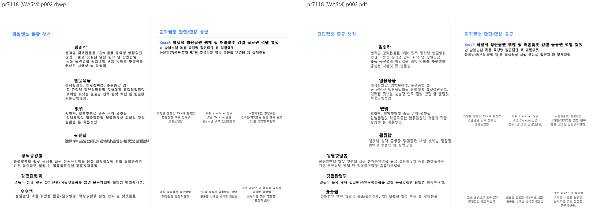

# PR #7118 검토

## 판정

**머지 보류** — 저장 LineSeg 없는 Square 어울림 재조판 범위. 개별 PR의 검토 의견이며, 이 batch의 통합 head 전체 수용 또는 원격 merge 승인이 아니다.
통합 head는 #7118의 실행 회귀와 #7184의 경계 증거 부족으로 **머지 보류**다.
CI 재실행·remote push·통합 PR 생성·source PR close는 하지 않았다.

## 검토 대상

| 항목 | 확인값 |
| --- | --- |
| 원 PR | [#7118](https://github.com/edwardkim/rhwp/pull/7118) |
| 제목 | 수정(renderer): 저장 LINE_SEG 없는 문서의 Square 어울림 문단이 단을 넘지 않게 한다 (#6970) |
| 작성자 / reviewer | davindev (기존 기여자) / jangster77 사전 요청 |
| 원 head | `aff426a709c472d812b199ef41a0968f6a96b900` |
| source base / 규모 | devel / 21 files, +950/-70, 1 commits |
| 원 PR 상태 | OPEN / draft=False / CONFLICTING / DIRTY |
| source CI | [Build & Test](https://github.com/edwardkim/rhwp/actions/runs/35058808168) 및 전체 rollup 실패/대기 없음; 검토 종료 전 source head 불변 확인 |
| 통합 base | `8d45f242baa1a565357aaa38e9f459595b1e756c` |
| 통합 code head | `2a2089bf71e7a42286e0643a3fb517b7047c7320` + #7118 fixture 참조 경로 보정(실행 바이트 동일) |
| branch | `codex/open-pr-review-20260916` |
| 충돌 해결 | 최신 FloatLane `Some(ctrl_idx)`를 유지하고 미완성 주석은 제외했다. |

원 commit은 `-x`로 누적 적용했고 작성자·메시지·co-author를 보존했다.
source/local SHA와 실행 명령은 [검증 기록](pr_7118_review_impl.md), 공통 제한은 [회차 보고](../../working/task_m100_6970_open_pr_stage1.md)에 있다.
route: collaborator_external_pr + intake/local_validation/multi_pr_update_branch/visual_fixture_evidence.
#7118의 1,000줄 초과 변경은 별도 코드·실행·시각 검토로 취급했고 admin merge는 하지 않았다.

## 변경·증거 심사

### 실행으로 확인한 차단 사항

1. `issue_7095_page_spanning_fragment_box::projected_picture_fragment_does_not_claim_a_stored_page_frame`가 실패한다.
   `samples/issue2004_cell_image_stack.hwp` 5쪽 그림 프레임 하단은 937.80px이며 독립 PDF 기준 931.48px보다 6.32px 아래다.
   기존 ±2px 계약을 바꾸지 않았다. 누적 조합 53/54, #7184만 제외한 대조군 5/6,
   **#7118만 제외한 대조군 6/6 통과**다. 해당 회귀는 #7184로 오인하지 않는다.
2. 익명화 fixture의 Native·fresh WASM Visual Sweep 2쪽 왼쪽 중간 `필필함` 아래에서,
   PDF 두 줄이 rhwp에서는 같은 높이에 겹친다. 새 focused 테스트는 이 출력에서도 통과한다.
   따라서 “단 바깥으로 나가지 않는다” 검사가 실제 줄 구성·글자 겹침까지 입증하지 않는다.

### 코드 검토상 차단 사항

- `src/renderer/mod.rs::synth_wrap_fit_slack_px`는 글꼴 메트릭을 고치는 대신 폭의 6%를 더한다.
  주석도 특정 세 줄을 맞춘 역산이라고 설명한다. 정확한 메트릭이 있는 글꼴·라틴 본문에도 적용되는
  비적용 경계가 없어 공통 조판 원칙의 샘플 수치 맞춤 금지와 맞지 않는다.
- `typeset.rs::para_is_page_banner_header`는 보이는 텍스트와 Paper/BehindText 그림 너비 85%로
  “배너”를 추정한다. `banner_tail_absorb_para` 소비에서는 실제 문자색·뒤 내용의 높이·소유를
  확인하지 않고 `current_height = available`로 덮어쓴다. “흰 글씨라 보이지 않는다”는 주석의 전제를
  조건이 보증하지 않는다. 문단 순서 재배열과 빈 문단 제거까지 포함하므로 배너 모양이라는 이유만으로
  이월·순서·높이 계약을 대체할 수 없다.
- `recalculate_section_vpos`의 새 저장 간격 보존은 간격이 다음 첫 줄 높이 이상이면 객체 점유로
  간주한다. 실제 객체 소유·좌표계 근거와 편집/저장 재사용 경계 반례가 필요하다.

### 해제 조건

위 실패를 허용치 갱신 없이 해결하고 동일 회귀의 RED/GREEN, 2쪽 줄 겹침 해소를 Native/WASM
Visual Sweep으로 남긴다. 임의 slack과 배너 높이 덮어쓰기를 공통 메트릭·명시적 객체 소유에 맞추고
실제 적용/비적용 경계를 검증한다. 이번 요청의 충돌 해결과 중복 fixture 제거는 완료했지만,
이 의미적 차단 사항은 원 코드의 추가 보정이 필요하다.

## 공통 조판 원칙

| 항목 | 판정 | 근거 |
| --- | --- | --- |
| 구현 근거·일반성 | 미충족 | 6% slack·배너 모양 추정/높이 덮어쓰기 |
| 측정·배치 일관성 | 미충족 | 실행 프레임 회귀 및 2쪽 글줄 겹침 |
| 분할·이어받기 | 미검증 | 배너 재배열/흡수의 유닛·다음 내용 계약 부족 |
| 줄 소속·점유 높이 | 미충족 | PDF 두 줄과 candidate 겹친 한 줄 |
| 증거 독립성 | 충족 | 동일 입력의 MCP PDF, Native/WASM 및 제거 대조군 |
| 기준값 변경 | 비해당 | 기존 프레임 ±2px 허용치를 유지 |
| 주장·검증 범위 | 미충족 | focused 통과가 실제 겹침을 검출하지 못함 |

## 증적

시각 검토 정본: [Visual Sweep](../../manual/verification/visual_sweep_guide.md).
Native/WASM의 PNG 라벨과 본문을 구분해 직접 열었다. HWP3 저장 비교 이미지는 Visual Sweep의
`make_compares`로 **후보를 한컴이 출력한 PDF(왼쪽)**와 **원본 한컴 PDF(오른쪽)**를 합친 것이다.
그 이미지의 기본 `rhwp` 라벨은 Native renderer 출력을 뜻하지 않는다.
[입력/PDF 해시 원장](../assets/pr7118_7187_review/fixture-manifest.json), [시각 지표](../assets/pr7118_7187_review/visual-metrics.json),
[focused 결과](../assets/pr7118_7187_review/focused.log)를 함께 보존했다. 낮은 pixel/ink proxy는 완전 일치로 해석하지 않는다.

직접 사용한 기존 HWP/HWPX는 기존 Git 경로를 재사용했다. 새 한컴 PDF와 누적 저장 HWP는 이 검토
회차 commit에 포함한다. 아직 merge하지 않았으므로 source PR/issue는 닫지 않는다.
