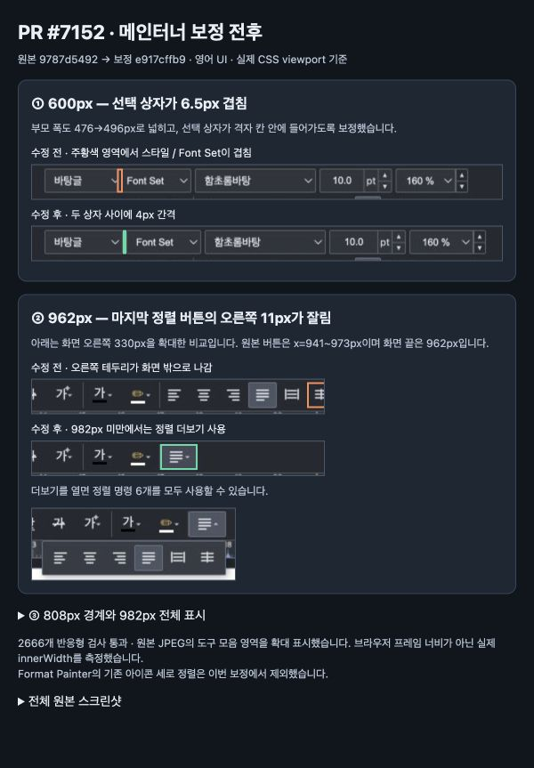

# PR #7152 — 메뉴·툴바 영어 표시 검토 기록

**최종 판정: 메인터너 보정 후 수용 가능.** 원본에서 재현한 필드 겹침과 반응형 경계 잘림을 별도 로컬 커밋으로 보정했다. 보정 후보의 로컬 검증을 완료했으며, 원격 push·새 head CI·GitHub review·merge는 아직 수행하지 않았다. 이 문서는 사용자가 요청한 로컬 검토용 기록이다.

- [스크린샷 비교 페이지](../assets/pr7152_comparison.html)
- [기여자에게 보낼 코멘트 초안](pr_7152_comment_draft.md)
- [단계별 보정·반영 기록](pr_7152_review_impl.md)

## 1. 검토 대상과 범위

| 항목 | 기록 |
| --- | --- |
| PR | [#7152](https://github.com/edwardkim/rhwp/pull/7152) — feat(i18n): 메뉴·툴바 영어 표시 — UI 문자열 로케일 분리 2/4 (#5852) |
| 기여자 | rubidus-api, fork `rubidus-api/rhwp`, branch `i18n/2-menus` |
| 원 contributor head | `9787d549237b4c678605c1ade7ba116ee2515baf` |
| 메인터너 보정 / 검증 code head | `e917cffb9f70dfc73451a32fb4c1bf3ef9cffc8c` |
| 로컬 branch | `codex/pr7152-review-20260915` — 원 commit 위에 직접 추가 |
| Base | `devel`; PR API baseRefOid는 `a2cc0d236f0b348e00d6ee14af1ff86323a93c67` |
| 초기 호환 확인 대상 | fetched `upstream/devel@769582fc856f162e57604b318d41414d7b026345`와 원 PR의 merge simulation 성공. 보정 후보를 최신 devel에 통합·실행한 검증은 별도 미실행 |
| 원 PR 규모 | 1 commit, 7 files, +1157 / −358 |
| 보정 규모 | CSS, overflow controller, responsive E2E의 3 files |
| 작성 시점 참고값 | OPEN, draft=false, MERGEABLE/CLEAN, maintainerCanModify=true, reviewer=postmelee, labels/assignees 없음 |

보정 시작 시 PR API head, source branch `ls-remote`, 로컬 시작 SHA가 모두 일치했다. contributor 원 commit의 저자·본문·이력을 보존했다. 기본 작업공간의 사용자 변경 `samples/exam_eng.pdf`는 이 worktree에 포함하거나 변경하지 않았다.

[이슈 #5852](https://github.com/edwardkim/rhwp/issues/5852)의 4단계 중 메뉴·툴바 정적 문자열을 분리하는 2단계다. 선행 #7142가 이미 병합됐으므로 첫 기여 PR은 아니다. 대화상자 전체 번역과 나머지 명령 표시 전환은 후속 단계다. 이 PR만으로 #5852 완료·close를 판단하지 않는다.

## 2. 원 변경 리뷰 요약

- `index.html`의 i18n 속성 396곳을 제거하면 원 commit 부모의 HTML과 바이트 단위로 동일했다. 기존 명령 ID·DOM 순서·원문 fallback을 유지했다.
- 마크업이 참조하는 키는 385개이며 ko/en catalog는 각각 401개다. 두 catalog 모두 마크업 참조 누락 키가 없었다. [재계산 결과](../assets/pr7152_evidence.json).
- 변경된 세 단위 테스트는 i18n 속성 추가를 허용하는 범위다. 기존 명령 유일성·구조에 대한 검증은 유지된다.
- 영어 `Font Set` 열을 64→84px로 넓히는 방향은 타당하다. 그러나 격자 부모 폭과 그 폭을 소비하는 반응형·접근성 경계가 함께 변경되지 않아 아래 두 결함이 생겼다.
- 문서의 실제 스타일명·글꼴명과 후속 단계의 동적 대화상자는 이번 정적 UI 번역의 완료 범위와 구분한다.

## 3. 실행으로 재현한 결함과 보정

### 3.1 600px — 스타일 선택 상자와 Font Set의 겹침

재현: Studio `/?lang=en`, 실제 `window.innerWidth=600`, 기본 스킨. 바탕글/Font Set이 있는 첫 서식 행을 확인한다.

| 항목 | 원 head | 보정 head |
| --- | --- | --- |
| 필드 부모 폭 | 476px | 496px |
| 스타일 오른쪽 / 언어 왼쪽 | 102 / 95.5px | 102 / 106px |
| 두 상자의 간격 | −6.5px: 실제 겹침 | +4px |

**원인:** 영어 격자만 최대 496px로 넓혔고 부모 `.sb-field-ribbon-group`은 476px였다. 600px 화면에서 첫 격자 칸은 77.5px로 줄어들지만 `#style-name { width:88px }`이 더 강한 선택자로 남아 칸 밖에 그려졌다.

**보정:** 영어 부모도 `min(496px,100%)`로 맞추고 `#style-name`에 `max-width:100%`를 적용해 실제 격자 칸을 따르게 했다. 겹친 부분을 잘라 숨기거나 좌표를 강제로 이동하지 않았다. 같은 고정 폭 문제가 있던 한국어의 좁은 화면에서도 필드가 칸을 벗어나지 않게 된다. 한국어의 808/962px 전환 기준은 유지했다.

[원본 화면](../assets/pr7152_en_600_before.jpg) · [보정 화면](../assets/pr7152_en_600_after.jpg)

### 3.2 808px·962px — 영어 한 줄 배치에 필요한 폭 미반영

**용어 정정:** 원본의 **808px은 한 줄 compact 전환**, **962px은 정렬 버튼 6개를 모두 펼치는 전환**이다. 962px을 “한 줄 전환 경계”로 설명했던 것은 부정확했다. 사용자가 확인한 600px 두 줄 화면에는 이 마지막 버튼 잘림이 없다.

| 실제 CSS viewport | 원 head에서 재현한 결과 | 보정 head |
| --- | --- | --- |
| 808px / en | 더보기 버튼 오른쪽=818px, 10px 밖으로 나감 | 두 줄 유지, document width=808px |
| 827px / en | 영어 폭 증가를 반영하지 않은 한 줄 | 두 줄 유지 |
| 828px / en | — | 한 줄 compact 시작, 버튼 전체가 viewport 안에 위치 |
| 962px / en | 마지막 버튼 x=941~973px, 오른쪽 11px 잘림; 아이콘 오른쪽=966px, 4px 잘림 | 더보기 사용, document width=962px |
| 981px / en | — | compact 유지 |
| 982px / en | — | 정렬 버튼 6개 전체 표시, 마지막 오른쪽=973px |
| 808 / 962px / ko | 기존 전환 | 각각 compact / 전체 표시 유지 |

**원인:** 영어 field group에 추가한 20px가 원래의 808/962px media query에 반영되지 않았다. 명령 영역은 `flex-shrink:0`이므로 전체 폭이 그대로 밖으로 밀렸다.

**보정:** 영어 CSS 경계를 828/982px로 이동하고 overflow controller도 같은 로케일별 query를 선택하게 했다. CSS만 수정하면 962~981px의 패널 `hidden`·열기·키보드 포커스가 불일치할 수 있어 실제 제품 controller까지 맞췄다. CSS와 JS의 이중 선언은 실제 브라우저 경계 검사로 일치 여부를 보호한다.

962px에서 명령을 제거한 것이 아니라 기존 더보기 패널에 접는다. 패널을 열었을 때 마지막 버튼은 x=781~813px이며 여섯 정렬 명령이 모두 보인다. ArrowDown으로 열기와 첫 명령 포커스, Escape로 닫기와 트리거 포커스 복귀를 검증했다.

[808px 전](../assets/pr7152_en_808_before.jpg) · [808px 후](../assets/pr7152_en_808_after.jpg) · [962px 전](../assets/pr7152_en_962_before.jpg) · [962px 후](../assets/pr7152_en_962_after.jpg) · [패널 열기](../assets/pr7152_en_962_panel_after.jpg) · [982px 전체 표시](../assets/pr7152_en_982_after.jpg)

### 3.3 Format Painter — 이번 보정에서 제외

사용자 주석의 Format Painter는 버튼·아이콘·각 텍스트 행의 가로 중심이 168px로 일치했다. 한 줄 라벨 버튼과 비교한 아이콘의 약 5.5px 세로 차이는 `.tb-btn`이 아이콘과 라벨을 묶어 가운데 정렬하는 기존 방식에서 온다. 한국어에서도 한 줄/두 줄 라벨 사이에 같은 차이가 있다.

따라서 영어 번역으로 새로 생긴 가로 중앙 정렬 결함으로 분류하지 않았다. 아이콘의 세로 기준선을 일괄 맞추는 디자인 개선은 별도 범위로 남기며 이번 source 보정에 포함하지 않았다. 별도 GitHub issue도 생성하지 않았다.

## 4. 완료 검증과 실행 증거

검증 source는 `e917cffb9f70dfc73451a32fb4c1bf3ef9cffc8c`의 code 내용이다. 최종 테스트 실행 이후 바뀐 source는 CSS 설명 주석뿐이며 실행 코드·테스트·CSS 선언은 동일하다.

| 검증 | 실행 결과 |
| --- | --- |
| exact lockfile `npm ci` + dev WASM | 원 PR 검증 때 완료. `scripts/wasm-pack-locked.sh --target web --out-dir pkg --dev`, 고정 `target/pr-review` 사용. 보정에서 Rust/Cargo/pkg 생성 입력 변경 없음 |
| `./node_modules/.bin/tsc --project tsconfig.ci-unit.json --noEmit` | exit 0 |
| `npm test` | 1736 tests, **1734 pass / 0 fail / 2 skip** — [로그](../assets/pr7152_unit.log.txt) |
| `npm run build` | 전체 tsc + Vite production build 성공 — [로그](../assets/pr7152_build.log.txt) |
| `node e2e/responsive.test.mjs --mode=headless` | **2666 pass / 0 fail** — [assertion 보고서](../assets/pr7152_responsive_report.html), [로그](../assets/pr7152_responsive.log.txt) |
| 원 PR 음성 대조 `--locales-only` | **1410 pass / 138 fail** — [보고서](../assets/pr7152_negative_report.html), [로그](../assets/pr7152_negative.log.txt). 실패 숫자는 반복 조건별 assertion 수이며 독립 결함 138개를 뜻하지 않음 |
| `git diff --check` | 통과 |

E2E 환경: macOS의 별도 headless Chrome, `CHROME_PATH='/Applications/Google Chrome.app/Contents/MacOS/Google Chrome'`, `VITE_URL=http://127.0.0.1:7715`. 사용자가 열어 둔 브라우저 프로필을 테스트에 연결하지 않았다.

추가 회귀는 ko/en × default/flat/oldschool × light/dark 12조건에서 19회의 확대·축소 순서를 실행했다. 서로 다른 폭은 **375,459,460,600,807,808,827,828,961,962,981,982,1024px**이며 982→981, 828→827, 460→459 하강도 확인했다. 제품 `/?lang=` 진입점에서 5개 필드의 부모 내부 수용, 필드 간격, root overflow, 행 수, CSS/controller hidden 상태, 마지막 명령 위치, 키보드 열기·닫기를 검사했다. 새 검사의 보정 결과는 1584 pass / 0 fail이며 나머지는 기존 responsive suite다.

음성 대조는 원 PR CSS/controller를 그대로 복원하고 새 회귀 검사를 적용한 실행이다. en/600의 −6.5px 간격, en/808의 10px overflow, en/962의 12px document overflow를 검출했다. 12px는 마지막 group border까지 포함하며 버튼 자체의 잘림은 11px다. 기존 한국어 모바일에서도 고정 88px 선택 상자의 겹침을 검출했다. 대조 후 보정 파일을 복원한 상태에서 전체 E2E를 다시 통과했다. 초기 음성 대조의 숨겨진 버튼 포커스 대기는 중단했고, 최종 보고서는 실제 트리거가 있을 때만 포커스 검사를 진행하도록 한 완결 실행이다.

원 head의 GitHub aggregate checks는 녹색이었다. Rust lint·Native Skia·일부 archive/Frontend unit job은 SKIPPED였으며 실행 성공으로 세지 않는다. 보정 head는 push하지 않아 GitHub CI가 없다. **원 head CI를 보정 head CI로 재사용하지 않는다.** 확장 전체 패키징·Firefox/Safari 실행·모든 viewport와 번역 품질의 전수 검증은 이번 로컬 결과로 주장하지 않는다.

## 5. 조판 원칙·검증 입력·시각 증거 범위

- 조판 원칙: **비해당**. 문서 줄 구성·측정/배치·pagination·paint·backend·golden·baseline을 변경하지 않았다. UI chrome의 CSS layout과 접근성 상태만 보정했다.
- 검증 입력 커밋: **비해당**. 앱에서 생성한 빈 문서와 DOM을 사용했으며 외부 HWP/HWPX/PDF를 입력으로 사용하지 않았다.
- [시각 검증 거버넌스](../../manual/verification/visual_verification_governance.md)의 Studio UI 경로에 따라 실제 브라우저 E2E와 전후 화면을 사용했다. PDF/SVG Visual Sweep·한컴 정답지 대조는 수행하지 않았다. UI 스크린샷을 문서 렌더링 호환성 증거로 해석하지 않는다.
- 대표 조건 600/808/962/982px의 도구 모음을 직접 판독했다. 사용자는 원본 962px 경계 결함을 비교 페이지로 확인했고, **보정 후 화면에 대한 최종 사용자 확인은 이 기록을 통해 받는 단계**다.
- 파일은 브라우저가 반환한 원본 JPEG를 변환 없이 보존했다. 비교 HTML은 원본의 도구 모음 영역을 CSS로 잘라 보여 주고 경계만 표시한다. 래스터 원본에 덧그리거나 내용을 수정하지 않았다. 원본 해상도는 파일명과 같은 너비 × 863px이며 SHA-256은 [증적 JSON](../assets/pr7152_evidence.json)에 있다.
- 별도 브라우저 캡처로 `innerWidth`와 이미지 크기를 대조했다. 도구의 viewport 변경 직후 이전 크기가 남은 중간 캡처와 잘못된 clip 캡처는 최종 증거에서 제외했다.

## 6. 원격 반영 전 남은 조건

1. 사용자가 이 로컬 보정·리뷰·코멘트 초안을 확인하고 push 범위를 결정한다.
2. PR head/source remote가 원 SHA와 같은지 다시 확인하고, 허용된 source branch에만 추가 commit을 반영한다. 기여자 이력은 rewrite하지 않는다.
3. 보정 code를 포함한 최신 head의 관련 CI와 최신 devel 호환·merge 가능 상태를 확인한다. 필요한 최종 기록·오늘할일은 이때 실제 상태로 정리한다.
4. GitHub review·comment·merge는 해당 단계 승인 후에 수행한다. 현재 판정은 원본 head의 그대로 승인 또는 merge 승인이 아니다.

## Merge 후 contributor PR comment 계획

[Visual Sweep 정본](../../manual/verification/visual_sweep_guide.md)과 위 거버넌스의 UI 예외를 연결하고, 기여자의 메뉴·툴바 문자열 분리 기여와 별도 보정 사유를 분리해 설명한다. 이번 증거는 빈 문서 1페이지의 UI, 2종 결함, 12개 로케일/스킨/테마 조합의 경계 검사이며 PDF pixel·ink·drift 지표는 비해당이다. 검토자의 직접 판독과 사용자 확인 범위를 구분한다.

대표 이미지의 안정 경로는 `mydocs/pr/assets/pr7152_comparison.jpg`다. 실제 게시 시 asset이 포함된 commit이 원격에 존재하는지 확인하고, merge 후라면 `https://raw.githubusercontent.com/edwardkim/rhwp/<merge-commit-sha>/mydocs/pr/assets/pr7152_comparison.jpg`처럼 SHA를 고정한다. 게시 본문은 UTF-8 파일을 `--body-file`로 전달하고 API로 본문·이미지 링크를 재조회한다. 현재 코멘트는 초안이며 게시 승인이나 merge 완료를 뜻하지 않는다.
