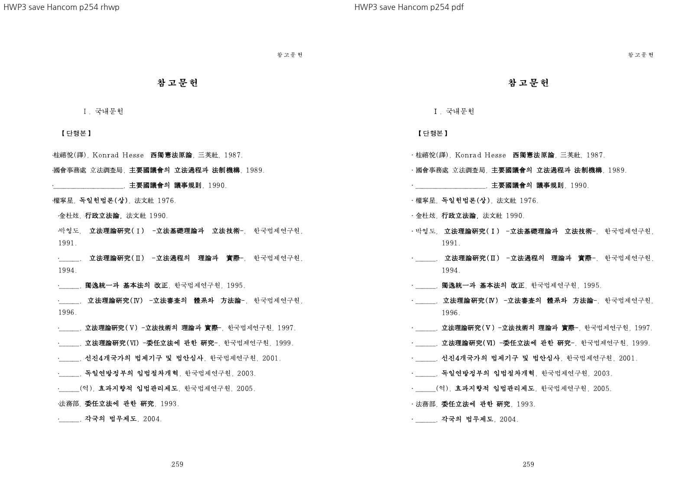

# PR #7180 검토

## 판정

**승인** — HWP3 내어쓰기 여백과 줄 상자의 이중 들여쓰기 수정 범위. 검증한 변경 범위에 대한 로컬 검토 판정이며 전체 이슈 해결 판정과 구분한다.
메인터너 보정 `f2e21164c029320d1e9b42a8c8ad1751c69fcb1d`에서 #7118의 실행 회귀·코드 원칙 위반과 #7184의 끝 컷/경계 증거 부족을 해소했다.
최종 로컬 검토는 **검증한 변경 범위 승인**이다. 통합 코드의 원격 CI는 PR 제출 후 확인할 항목이다.
[2회차 결과·제한 사항](../../working/task_m100_6970_open_pr_stage2.md)과 [최종 검증 결과](../assets/pr7118_7187_review_stage2/gate-results.json)를 기준으로 한다.
CI 재실행·remote push·통합 PR 생성·source PR close는 하지 않았다.

## 검토 대상

| 항목 | 확인값 |
| --- | --- |
| 원 PR | [#7180](https://github.com/edwardkim/rhwp/pull/7180) |
| 제목 | 수정(parser/hwp3): 내어쓰기 문단의 첫 줄 기준 여백을 일반 규칙으로 옮긴다 (#7172) |
| 작성자 / reviewer | planet6897 (기존 기여자) / jangster77 사전 요청 |
| 원 head | `6989418dee9998d7044bfd807d34f4b6f907fadb` |
| source base / 규모 | devel / 6 files, +175/-15, 1 commits |
| 원 PR 상태 | OPEN / draft=False / MERGEABLE / CLEAN |
| source CI | [Build & Test](https://github.com/edwardkim/rhwp/actions/runs/35016722579) 및 전체 rollup 실패/대기 없음; 검토 종료 전 source head 불변 확인 |
| 통합 base | `8d45f242baa1a565357aaa38e9f459595b1e756c` |
| 통합 code head | `f2e21164c029320d1e9b42a8c8ad1751c69fcb1d` (메인터너 보정·검증 증적 포함) |
| branch | `codex/open-pr-review-20260916` |
| 충돌 해결 | 텍스트 충돌 없음. |

원 commit은 `-x`로 누적 적용했고 작성자·메시지·co-author를 보존했다.
source/local SHA와 실행 명령은 [검증 기록](pr_7180_review_impl.md), 공통 제한은 [2회차 보고](../../working/task_m100_6970_open_pr_stage2.md)에 있다.
route: collaborator_external_pr + intake/local_validation/multi_pr_update_branch/visual_fixture_evidence.
#7118의 1,000줄 초과 변경은 별도 코드·실행·시각 검토로 취급했고 admin merge는 하지 않았다.

## 변경·증거 심사

`convert_para_shape_with_layout_contract`가 음수 indent를 첫 줄 여백으로 정규화하고,
`hwp3_para_line_box`가 정규화한 여백에 음수 indent를 다시 더하지 않는다. 양수 indent와 오른쪽
여백은 유지한다. 암호 문서 전용 조건 해제는 한컴 저장본과의 독립 대조로 확인했다.

Git에 이미 보존된 실제 HWP3 입력을 누적 CLI로 HWP5 저장 후, 한컴 HWP5 기준과 **내용이 대응되는
3,699개 문단의 왼쪽/오른쪽 여백·indent 튜플이 전부 일치**했다. 서로 3,699/3,702 문단이므로
레코드 순번을 그대로 zip한 수치는 증거에서 제외하고 텍스트 대응을 사용했다.
focused 1개와 관련 #1692 계약이 통과했다. 양수 indent 반례는 원 PR의 기존 unit 테스트 수정에 있다.

한컴 engine 2020으로 원본·누적 저장본을 각각 출력한 PDF는 모두 264쪽이다.
직접 Visual Sweep 비교의 254·255쪽 참고문헌에서 후속 항목의 정렬과 내어쓰기를 확인했다.
글꼴/공백·하이픈 차이는 문서 전체 완전 일치로 판정하지 않는다. 이 판정은 여백 변환 범위다.

## 공통 조판 원칙

| 항목 | 판정 | 근거 |
| --- | --- | --- |
| 구현 근거·일반성 | 충족 | 독립 한컴 HWP5 레코드와 위 적용/비적용 조건 |
| 측정·배치 일관성 | 충족 | 정규화한 여백→줄 상자 소비 |
| 분할·이어받기 | 비해당 | 컷 알고리즘 변경 없음 |
| 줄 소속·점유 높이 | 비해당 | 줄/객체 재조판 규칙 변경 없음 |
| 증거 독립성 | 충족 | 기존 원본·한컴 HWP5·새 저장본 PDF 직접 대조 |
| 기준값 변경 | 비해당 | baseline 완화 없음 |
| 주장·검증 범위 | 충족 | 위 저장 필드 범위 및 미해결 축 구분 |

## 증적

최종 공통 검증: focused 66/66, 전체 nextest 9933/9933(기존 skip 51), Clippy 3종, Native Skia 3종 통과.
새 WASM host `--no-opt` 진단 빌드와 Native의 6문서 22쪽 Visual Sweep을 완료했다.
Docker 배포 최적화 경로는 미실행이며 표준 원격 CI 통과로 대체 표기하지 않는다.
[최종 실행 결과](../assets/pr7118_7187_review_stage2/gate-results.json) · [시각 실행](../assets/pr7118_7187_review_stage2/visual-results.json) · [입력 원장](../assets/pr7118_7187_review_stage2/fixture-manifest.json).

시각 검토 정본: [Visual Sweep](../../manual/verification/visual_sweep_guide.md).
Native/WASM의 PNG 라벨과 본문을 구분해 직접 열었다. HWP3 저장 비교 이미지는 Visual Sweep의
`make_compares`로 **후보를 한컴이 출력한 PDF(왼쪽)**와 **원본 한컴 PDF(오른쪽)**를 합친 것이다.
그 이미지의 기본 `rhwp` 라벨은 Native renderer 출력을 뜻하지 않는다.
1회차(보정 전)의 [입력/PDF 해시 원장](../assets/pr7118_7187_review/fixture-manifest.json), [시각 지표](../assets/pr7118_7187_review/visual-metrics.json),
[focused 이력](../assets/pr7118_7187_review/focused.log)를 함께 보존했다. 낮은 pixel/ink proxy는 완전 일치로 해석하지 않는다.

직접 사용한 기존 HWP/HWPX는 기존 Git 경로를 재사용했다. 1회차의 한컴 PDF와 누적 저장 HWP는 `788ab292b`에 이미 포함돼 있다.
2회차는 기존 Git 입력·PDF를 재사용하고 새 비교 이미지와 로그를 보존했다. 아직 merge하지 않았으므로 source PR/issue는 닫지 않는다.
