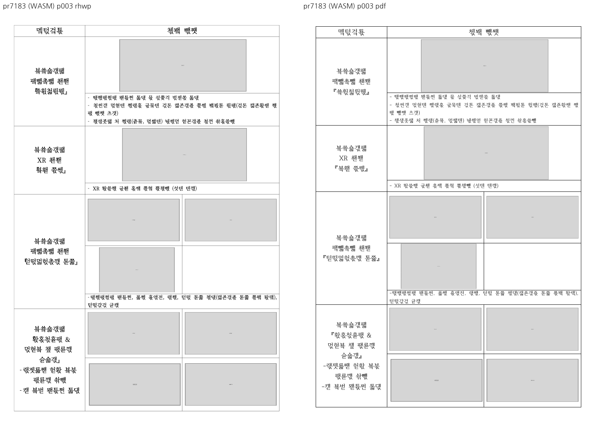

# PR #7183 검토

## 판정

**승인** — 분할 표의 그림만 있는 문단 복원 범위. 개별 PR의 검토 의견이며, 이 batch의 통합 head 전체 수용 또는 원격 merge 승인이 아니다.
통합 head는 #7118의 실행 회귀와 #7184의 경계 증거 부족으로 **머지 보류**다.
CI 재실행·remote push·통합 PR 생성·source PR close는 하지 않았다.

## 검토 대상

| 항목 | 확인값 |
| --- | --- |
| 원 PR | [#7183](https://github.com/edwardkim/rhwp/pull/7183) |
| 제목 | 수정(renderer): 분할 표 칸에서 글자 없이 그림만 든 문단이 어느 조각에도 배치되지 않던 것을 고친다 (#7182) |
| 작성자 / reviewer | davindev (기존 기여자) / jangster77 사전 요청 |
| 원 head | `fb50aa6cfaa054ff845bdf211b574a6cf99d98b6` |
| source base / 규모 | devel / 3 files, +116/-10, 1 commits |
| 원 PR 상태 | OPEN / draft=False / MERGEABLE / CLEAN |
| source CI | [Build & Test](https://github.com/edwardkim/rhwp/actions/runs/35055413849) 및 전체 rollup 실패/대기 없음; 검토 종료 전 source head 불변 확인 |
| 통합 base | `8d45f242baa1a565357aaa38e9f459595b1e756c` |
| 통합 code head | `2a2089bf71e7a42286e0643a3fb517b7047c7320` + #7118 fixture 참조 경로 보정(실행 바이트 동일) |
| branch | `codex/open-pr-review-20260916` |
| 충돌 해결 | 텍스트 충돌 없음. |

원 commit은 `-x`로 누적 적용했고 작성자·메시지·co-author를 보존했다.
source/local SHA와 실행 명령은 [검증 기록](pr_7183_review_impl.md), 공통 제한은 [회차 보고](../../working/task_m100_6970_open_pr_stage1.md)에 있다.
route: collaborator_external_pr + intake/local_validation/multi_pr_update_branch/visual_fixture_evidence.
#7118의 1,000줄 초과 변경은 별도 코드·실행·시각 검토로 취급했고 admin merge는 하지 않았다.

## 변경·증거 심사

`table_partial.rs`에서 row 범위가 정해진 **uncut** fragment의 control-only 문단 구제에 Picture를
포함한다. cut fragment에는 구제를 확장하지 않아 기존 유닛 소유를 보존한다. 세로 가운데 정렬의
콘텐츠 높이에 TAC 그림 높이를 반영하며, 음수 offset의 상단 이탈 보정은 Center에만 확장한다.
Top 경로의 완전 이탈 조건을 그대로 두는 것을 확인했다.

focused의 `issue_7182_rowbreak_cell_picture_only_paragraphs_render_inside_their_cells` 및 기존
#4059 Square 계약이 통과했다. 입력 4쪽·그림 11개와 각 이미지가 소유 셀 내부에 들어가는 실제 bbox를
검사한다. 한컴 PDF는 MCP 2020, 12.0.0.4605로 생성한 4쪽이다.
Native와 fresh WASM 1–4쪽을 직접 비교했고, 대표 3쪽에서 사진 9개와 셀 소유가 유지된다.
사진 복원 범위에 차단 결함은 없으며 글꼴·줄끝·표 하단의 기존 차이를 완전 fidelity로 포장하지 않는다.

합성 입력의 임의 다중 그림/여러 빈 문단 전체를 전수 검증한 것은 아니다. 이 PR은 source 컷이 없는
RowBreak fragment의 그림 복원 범위로 수용한다. CellBreak의 소유권 재설계로 확장해 해석하지 않는다.

## 공통 조판 원칙

| 항목 | 판정 | 근거 |
| --- | --- | --- |
| 구현 근거·일반성 | 충족 | 실제 그림-only fixture와 MCP 정본 |
| 측정·배치 일관성 | 충족 | control-only 높이/valign 및 소유 셀 bbox |
| 분할·이어받기 | 충족 | uncut row owner만 구제; cut_units 있는 경로 유지 |
| 줄 소속·점유 높이 | 충족 | 11개 이미지 소유 셀 내부 검증 |
| 증거 독립성 | 충족 | 동일 입력의 Native/WASM/한컴 4쪽 |
| 기준값 변경 | 비해당 | 없음 |
| 주장·검증 범위 | 충족 | 사진 복원에 한정, 완전 fidelity 아님 |

## 증적

시각 검토 정본: [Visual Sweep](../../manual/verification/visual_sweep_guide.md).
Native/WASM의 PNG 라벨과 본문을 구분해 직접 열었다. HWP3 저장 비교 이미지는 Visual Sweep의
`make_compares`로 **후보를 한컴이 출력한 PDF(왼쪽)**와 **원본 한컴 PDF(오른쪽)**를 합친 것이다.
그 이미지의 기본 `rhwp` 라벨은 Native renderer 출력을 뜻하지 않는다.
[입력/PDF 해시 원장](../assets/pr7118_7187_review/fixture-manifest.json), [시각 지표](../assets/pr7118_7187_review/visual-metrics.json),
[focused 결과](../assets/pr7118_7187_review/focused.log)를 함께 보존했다. 낮은 pixel/ink proxy는 완전 일치로 해석하지 않는다.

직접 사용한 기존 HWP/HWPX는 기존 Git 경로를 재사용했다. 새 한컴 PDF와 누적 저장 HWP는 이 검토
회차 commit에 포함한다. 아직 merge하지 않았으므로 source PR/issue는 닫지 않는다.
