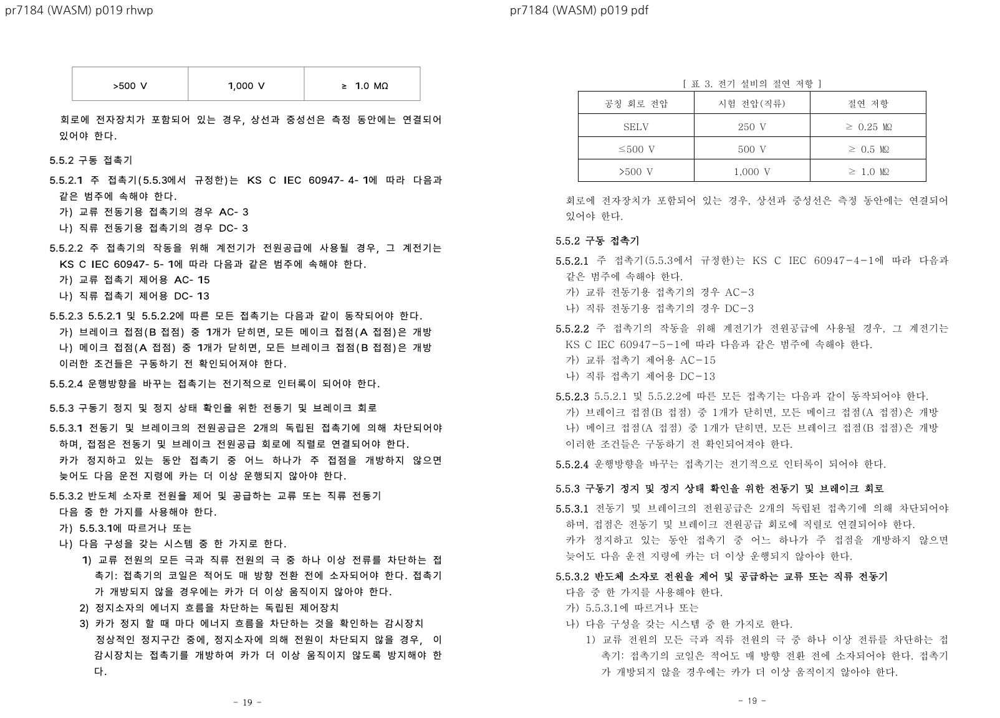

# PR #7184 검토

## 판정

**머지 보류** — 중첩 표 행 높이와 컷 예산 보완 범위. 개별 PR의 검토 의견이며, 이 batch의 통합 head 전체 수용 또는 원격 merge 승인이 아니다.
통합 head는 #7118의 실행 회귀와 #7184의 경계 증거 부족으로 **머지 보류**다.
CI 재실행·remote push·통합 PR 생성·source PR close는 하지 않았다.

## 검토 대상

| 항목 | 확인값 |
| --- | --- |
| 원 PR | [#7184](https://github.com/edwardkim/rhwp/pull/7184) |
| 제목 | 수정(layout): 중첩 표 행 유닛과 조각 예산을 페인트와 같은 값으로 센다 (#7140) |
| 작성자 / reviewer | planet6897 (기존 기여자) / jangster77 사전 요청 |
| 원 head | `52fbf006a83b5a46de152aa89b6303280eb23da5` |
| source base / 규모 | devel / 8 files, +174/-52, 2 commits |
| 원 PR 상태 | OPEN / draft=False / MERGEABLE / CLEAN |
| source CI | [Build & Test](https://github.com/edwardkim/rhwp/actions/runs/35045223986) 및 전체 rollup 실패/대기 없음; 검토 종료 전 source head 불변 확인 |
| 통합 base | `8d45f242baa1a565357aaa38e9f459595b1e756c` |
| 통합 code head | `2a2089bf71e7a42286e0643a3fb517b7047c7320` + #7118 fixture 참조 경로 보정(실행 바이트 동일) |
| branch | `codex/open-pr-review-20260916` |
| 충돌 해결 | 텍스트 충돌 없음. |

원 commit은 `-x`로 누적 적용했고 작성자·메시지·co-author를 보존했다.
source/local SHA와 실행 명령은 [검증 기록](pr_7184_review_impl.md), 공통 제한은 [회차 보고](../../working/task_m100_6970_open_pr_stage1.md)에 있다.
route: collaborator_external_pr + intake/local_validation/multi_pr_update_branch/visual_fixture_evidence.
#7118의 1,000줄 초과 변경은 별도 코드·실행·시각 검토로 취급했고 admin merge는 하지 않았다.

## 변경·증거 심사

`cell_units`의 다중 행 중첩 표가 실제 paint의 `resolve_row_heights`를 쓰게 한 축은 타당하다.
HWPX 저장 vpos 등식으로 line spacing을 계상하는 조건도 기존 800px 형상 가정을 줄인다.
focused 2개와 #5908 계약은 통과하고 HWPX는 48쪽이다. 19쪽의 본문 하단 넘침이 사라지는 범위는
확인했다. 기준 PDF와의 18–21·47–48쪽 Native/fresh WASM 비교도 수행했다.

**필수 경계 증거 미검증으로 보류한다.** `row_cut_mixed_nested_reserve`는 실제 선택될 `end_cut`을
받지 않고 `units.len()-1`을 가상 끝으로 사용한다. 호출하는 `mixed_nested_flow_extra_from_cut`에는
종결 컷·single-cell child·native recursive 등 다른 예약 규칙이 있고, 호출 이후 typeset에는
`source_tail_cut` 선택, budget 덮어쓰기, 실제 `row_cut_content_height` 재계산 및 재시도가 있다.
따라서 같은 helper를 사용했다는 이유만으로 최종 조각과 같은 값을 소비한다고 판정할 수 없다.

원 PR 신규 테스트는 페이지 수와 19쪽 overflow만 검사한다. 새 예약 차감이 실제로 발동하는
시작 컷/끝 컷, 원래 높이만 fit하는 예산, 최종 유닛 소비 후 다음 내용에 대해 실제 유닛 보존·요구 높이·
수용 높이를 연결한 독립 기대값 검사가 부족하다. #7095의 기존 공통 계약 테스트와 이 새 분기의 발동을
동일시하지 않았다. 이 항목은 재현된 데이터 손실이라고 단정하는 것이 아니라 필수 증거 부족이다.

**해제 조건:** 현재 helper 이후의 실제 소비 분기까지 경계를 연결하고, 관련 컷에서 요구/예약/paint 높이와
완전한 유닛 소유를 검사하는 작은 독립 기대값 테스트를 실행한다. 통째 표 이월은 별도 #7095 범위지만,
19쪽에서 PDF는 표 전체, 후보는 마지막 행만 남는 차이는 여전히 보인다. 48쪽 일치만으로 #7140 전체
해결을 선언하지 않는다. baseline 47→48은 PDF 쪽수 근거가 있으나 이것만으로 보류를 해제하지 않는다.

통합 회귀의 그림 프레임 실패는 #7184만 제외해도 남고 #7118 제외 시 사라졌다. 이 실패를 #7184의
실행 회귀로 귀속하지 않는다.

## 공통 조판 원칙

| 항목 | 판정 | 근거 |
| --- | --- | --- |
| 구현 근거·일반성 | 충족 | declared row fit/저장 등식과 실제 PDF |
| 측정·배치 일관성 | 미검증 | 가상 end_cut 뒤 재계산/예산 덮어쓰기 |
| 분할·이어받기 | 미검증 | 선택 컷/종결 컷/후속 유닛 경계 증거 부족 |
| 줄 소속·점유 높이 | 미검증 | row unit 개선 확인, 새 예약 분기 전체는 미확인 |
| 증거 독립성 | 충족 | 정본 PDF와 직접 Native/WASM 6쪽 |
| 기준값 변경 | 충족 | 47→48 독립 PDF 근거; 전체 시각 일치 의미 아님 |
| 주장·검증 범위 | 미검증 | 새 컷 예산의 의미별 테스트 보완 필요 |

## 증적

시각 검토 정본: [Visual Sweep](../../manual/verification/visual_sweep_guide.md).
Native/WASM의 PNG 라벨과 본문을 구분해 직접 열었다. HWP3 저장 비교 이미지는 Visual Sweep의
`make_compares`로 **후보를 한컴이 출력한 PDF(왼쪽)**와 **원본 한컴 PDF(오른쪽)**를 합친 것이다.
그 이미지의 기본 `rhwp` 라벨은 Native renderer 출력을 뜻하지 않는다.
[입력/PDF 해시 원장](../assets/pr7118_7187_review/fixture-manifest.json), [시각 지표](../assets/pr7118_7187_review/visual-metrics.json),
[focused 결과](../assets/pr7118_7187_review/focused.log)를 함께 보존했다. 낮은 pixel/ink proxy는 완전 일치로 해석하지 않는다.

직접 사용한 기존 HWP/HWPX는 기존 Git 경로를 재사용했다. 새 한컴 PDF와 누적 저장 HWP는 이 검토
회차 commit에 포함한다. 아직 merge하지 않았으므로 source PR/issue는 닫지 않는다.
