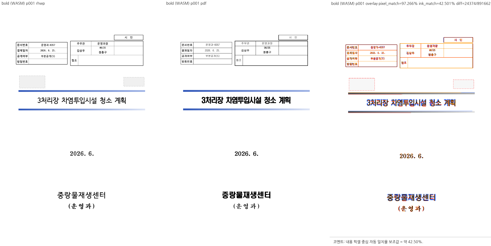
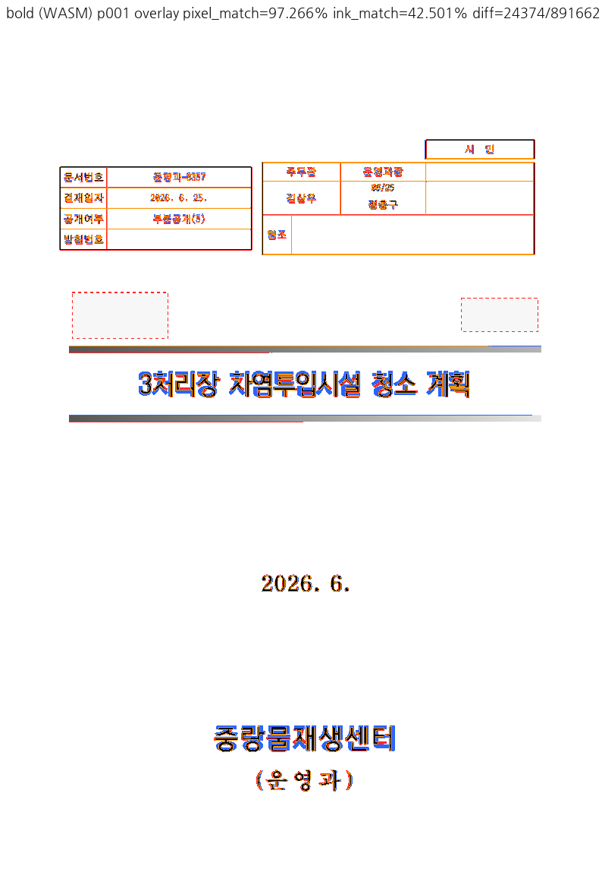
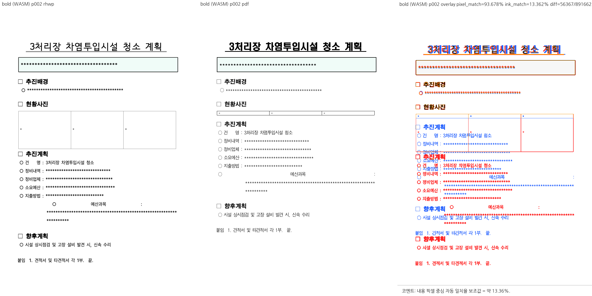
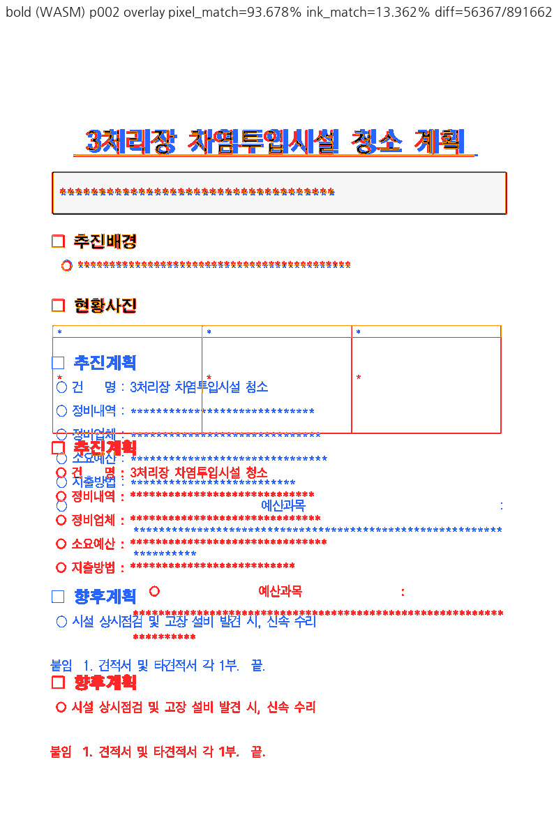

# PR #7212 검토

## 최종 판정

**머지 보류** — 0.02em 획 규칙과 geometry 보존은 확인했다. 그러나 실제 검토 환경에서 핵심 글꼴이 대체되어 원 글꼴의 굵기 개선을 직접 입증하지 못했다. 코드에서 새 회귀를 발견했다는 판정이 아니라 필수 시각 증거 부족이다.

이 판정은 로컬 cherry-pick 통합 검토이며 GitHub APPROVE 제출·remote push·PR 생성·merge·issue close는 수행하지 않았다.

## Metadata·계보·CI

| 항목 | 확인값 |
| --- | --- |
| PR | [#7212: Task #7151: 합성 볼드 굵기를 한/글과 같은 0.02 em 획으로 명시한다](https://github.com/edwardkim/rhwp/pull/7212) |
| 작성자 / reviewer | lpaiu-cs / jangster77 |
| base / state | devel / OPEN, non-draft |
| 규모 | 7 files, +981/-823, 1 commit |
| source head | `de7f0193668ea57e42bbf5eb09690edb37fcadc1` |
| 적용 commit / 통합 code head | `1c2bec6ec` / `3127bcce945b00bf7c767df2fb9da1f67ebb3633` |
| 조회 상태 | MERGEABLE / CLEAN; merge 직전 재조회 필요 |

- [Build & Test](https://github.com/edwardkim/rhwp/actions/runs/35161046927/job/105014782708): **SUCCESS**.
- [Native Skia tests](https://github.com/edwardkim/rhwp/actions/runs/35161046927/job/105011704049): **SUCCESS**.
- [CodeQL](https://github.com/edwardkim/rhwp/runs/105012556370): **SUCCESS**.

SKIPPED/NEUTRAL은 해당 검사가 실행되어 통과했다는 의미로 세지 않는다. source CI는 통합 head의 CI가 아니다.

## 코드·독립 증거 심사

대형 PR 예외 심사: 총 diff 1,804줄 중 대부분은 golden 5개의 기계적 paint 속성 치환이다. 아래 815개 요소 audit로 범위를 확인했고 geometry/허용치 완화로 취급하지 않았다. 원 작성자의 수정 전 FAIL 기록은 참고했으나 reviewer가 이전 코드를 rollback해 테스트한 것으로 계산하지 않는다.

`src/renderer/svg.rs`의 `faux_bold_stroke_width`를 normal text, rotated text, CharOverlap 두 경로가 소비한다. bold 요청이 metric DB의 regular로 떨어질 때만 0.02em stroke를 사용하며 실제 Bold face·unknown metric·비명시적 heavy face는 기존 경로를 유지한다. 새 layout 값이나 샘플별 조건을 추가하지 않는다.

기준 PDF 1쪽 ContentStream에서 Tr=2 텍스트 draw 15개를 직접 파싱했다. `w/Tf`는 모두 0.02이며 (75,1.5), (83,1.66), (175,3.5), (217,4.34)였다. 원 PR 수치를 그대로 인용한 것과 별개인 reviewer 실행이다. golden 5개 XML의 변경 815개는 font-weight 제거와 stroke/stroke-width 추가뿐이며 요소 수·텍스트·좌표·순서의 변화가 없었다. 통합본과 base의 실물 전체 SVG도 paint 속성을 제외하면 모두 동일했다.

**필수 증거 부족:** 36382471 p1의 실제 Chrome CDP `CSS.getPlatformFontsForNode` 결과는 굴림체 요청→**D2Coding**, HY헤드라인M 요청→**HCR Dotum**, HY견명조 요청→**HYmjrE**였다. 앞의 두 원 face를 사용한 굵기 비교가 아니다. 제목이 PDF보다 가늘게 보이는 차이와 p2의 표/본문 큰 차이를 사람이 직접 보았으며, `flagged=0`이나 평균 ink 지표의 소폭 상승으로 해결 판정을 하지 않는다. 폰트 대체와 기존 문서 차이를 이 PR의 신규 회귀로 보고하지도 않는다.

**해제 조건:** 정상 원 face를 실제로 선택하는 환경에서 같은 입력 p1의 제목·작은 굴림체 label을 base/수정본/PDF로 비교하고 실제 선택 face를 기록한다. fallback 출력은 별도 대조군으로 유지한다. 5개 golden의 paint-only audit는 이미 완료해 재작성할 필요 없다. font stretch가 stroke에도 적용되는 SVG 경로와 회전/CharOverlap의 픽셀 정합은 직접 PDF로 확인하지 않았으므로 이 범위까지 해결했다고 쓰지 않는다.

#7151은 이 검증이 끝나기 전 닫지 않는다. #7150의 문서 전체 표·텍스트 차이도 이 PR의 해결 범위로 포함하지 않는다.

## 공통 조판 원칙 준수

렌더 영향: **있음, Visual Sweep 필수**. 편집/생성 경로도 페이지 가시 출력과 fixture/PDF 주장을 포함하므로 적용한다.

| 항목 | 판정 | 근거 |
| --- | --- | --- |
| 구현 근거와 일반성 | 충족 | PDF Tr=2의 0.02em 실측과 metric bold_fallback, 샘플 조건 없음 |
| 측정·배치 일관성 | 충족 | layout 값 불변, 실제/unknown bold 경로 유지 |
| 분할·이어받기 계약 | 비해당 | paint 속성만 변경 |
| 줄 소속과 점유 높이 | 비해당 | 전체 base 비교에서 text/geometry 불변 |
| 사례와 증거의 독립성 | 미검증 | PDF 직접 파싱은 완료, 두 원 face의 실제 시각 비교는 미완료 |
| 기준값 변경 | 충족 | golden 815개 요소 paint-only를 독립 audit |
| 주장과 검증 범위 | 충족 | 대체 폰트·기존 차이와 직접 실행 범위 명시 |

## 통합 검토 공통 실행

- 기준 `upstream/devel`: `67af7443fddb09dcdc9913e944e8a134b8b95a3b`. 기본 작업공간에서 FF 동기화 후 `codex/open-pr-review-20260917` 생성.
- 순서: #7212 `de7f0193668ea57e42bbf5eb09690edb37fcadc1` → `1c2bec6ec`; #7230 `09fc9296080ed7eefc39791e06d6c2e207954201` → `368d6e4f8`; #7233 `4041972c2576e7d53494dc1fa27339a08f9de95a` → `e78d3a6cd`; #7238 `103ab177ab3c536a6d74d05ed59c10c67f37c605` → `3127bcce9`.각 cherry-pick은 `-x` provenance를 보존했다.
- code head `3127bcce945b00bf7c767df2fb9da1f67ebb3633`. #7229는 사용자 요청으로 제외했고 추가했던 reviewer 요청도 제거했다. draft #7222·#7236 제외. 원 PR 4개에 reviewer jangster77을 지정했다. 기존 contributor들이므로 첫 기여자 환영 절차는 해당하지 않는다.
- 전용 target `target/open-pr-review-20260917`. 초기 Xcode license 미동의 빌드 실패 후 시스템 설정을 바꾸지 않고 `DEVELOPER_DIR=/Library/Developer/CommandLineTools`로 Native/fresh WASM을 빌드했다.
- Native integrated binary SHA-256 `3df8a0bc692c2447d8514e1a3539fbd2251d0a9b98c122f0f7b2162660bfe071`. base binary `cdfd3af119e3880753368d6dc360db76d083aa99fe3a800172d59d09b8f16601`. base는 정확한 위 commit의 archive 소스로 별도 빌드했다. 캐시 혼입 방지를 위해 각 source의 lib.rs mtime만 갱신해 재컴파일했고 서로 다른 binary hash를 확인했다.
- WASM `419b6fef82a7352d6fdce034048d598c1fd914dacfd0e6a710f1b2da3834c843`, JS `a7353a7603b7e07db2d33ff93fff6b213ea79e01da91c190cbb607e752c6b5a7`. Docker daemon을 사용할 수 없어 `scripts/wasm-pack-locked.sh --target web --out-dir <scratch>/wasm --no-opt` 사용. 현재 code의 fresh WASM이지만 표준 Docker/wasm-opt release 검증 성공으로 세지 않는다.
- focused **27/27 PASS**, 새 sample 7개의 hidden/injection/unicode sweep **1/1 PASS**, fmt·suite manifest 정책·diff whitespace PASS. 소스별 전체 회귀 green은 위 exact source head의 CI이며 **통합본 전체 회귀·Clippy·Native Skia 재실행은 하지 않았다**. 보류가 남은 검토 단계라 통합 PR 제출 준비 완료로 보고하지 않는다.
- focused 선택: regression_suite_006/011/012/014/020에서 issue_7151(2), svg_snapshot(8), insert_page_break_contract(3), issue_3234_active_hf(4), issue_7216(3), issue_7218 CLI/core(7). `cargo nextest run --locked --cargo-profile release-test --target-dir target/open-pr-review-20260917`에 해당 suite/filter 적용. security는 suite_027 `new_sample_documents_are_clean_across_all_three_detectors`, `RHWP_SECURITY_SWEEP_SAMPLES_JSON`에 issue7218 HWPX 3개+issue7216 HWPX 4개를 명시했다.
- Visual Sweep은 base Native·통합 Native·fresh WASM 각 **12입력, 17선택쪽**, compare/overlay/review 모두 완료. 자동 flagged 후보는 각 0/17이지만 직접 본 큰 기존 차이와 폰트 대체를 승인으로 바꾸지 않았다.
- Native/WASM PNG는 16/17 화소 동일. aift p4는 (295,410)–(311,423)의 한자 `必` glyph만 다르며 표/줄 geometry 차이와 구분했다. 전체 동일이라고 쓰지 않는다.
- `fidelity_compare.py 0 <last-page> --source <HWP> --reference-pdf <PDF> --label <key> --text-only --export-all-svg --layout-ledger`를 전 입력에 실행했다. 전수 후보 원장은 scratch에 보존하고 아래에는 의미 있는 후보와 검토 범위를 요약한다. 로그·TSV·JSON은 커밋하지 않는다.

재현 sweep: `venv/bin/python scripts/visual_sweep.py --file-target <key> <HWP> <PDF> --rhwp-bin <검증 binary> --pages <선택쪽> --dpi 96 --out <scratch>`; WASM은 `--wasm-pkg <fresh package>`를 추가한다. 소스·스크립트·font policy는 위 code head를 사용했다. base sweep의 실행 cwd metadata도 통합 branch를 가리키므로 base provenance는 archive commit과 별도 binary hash로 판독해야 한다.

## Visual Sweep 직접 검토

DPI 96, Chrome webfont 경로. 모든 아래 선택쪽의 compare·standalone overlay·review를 직접 확인했다. 자동 후보는 reviewer 판정이 아니다. pixel/ink는 선택쪽 평균이며 백지 비율이 큰 문서의 높은 pixel 값은 정합성 근거가 아니다.

| key / 선택쪽 | rhwp/PDF 전체쪽 | 자동 후보 Native/WASM | base ink% | Native pixel% / ink% | WASM ink% |
| --- | --- | --- | --- | --- | --- |
| bold / 1,2 | 2/2 | 0/0 | 27.63423 | 95.47244 / 27.93105 | 27.93105 |
| real_bold / 1 | 10/10 | 0/0 | 30.48794 | 80.13137 / 30.52755 | 30.52755 |
| golden_bokhak / 1 | 1/1 | 1/1 | 46.26671 | 92.76194 / 46.33065 | 46.33065 |
| golden_157 / 2 | 2/2 | 0/0 | 31.30117 | 94.17537 / 31.30704 | 31.30704 |
| golden_ktx / 2 | 27/27 | 0/0 | 25.06871 | 93.83219 / 25.08071 | 25.08071 |
| golden_aift / 4 | 74/74 | 0/0 | 16.82484 | 90.26380 / 17.11555 | 17.11872 |

전수 fidelity의 aift p10→11 owner 후보 1개, p2 cell boundary 4개, table overlap 후보 1개는 변경 golden p4와 다른 위치다. 전체 SVG의 geometry/text는 base와 같고 paint만 달라졌으므로 새 페이지 회귀로 분류하지 않는다. form-002 등의 기존 표/텍스트 어긋남도 남는다. 17쪽 시각 검토를 전 문서 모든 쪽의 직접 감사로 부풀리지 않는다.

### 입력 커밋 확인 — 충족

아래 실제 실행 파일 모두 code head Git blob과 byte hash를 대조했다. 기존 원본/기준을 재사용했으며 별도 이름의 중복 입력은 추가하지 않았다. 신규 PR PDF는 한컴 변환 산출물을 그대로 사용했다. PDF format/Creator 버전 때문에 제외하거나 재변환하지 않았다.

| 경로 / 역할 | SHA-256 | 확인 commit |
| --- | --- | --- |
| [samples/issue2470/36382471_masked.hwpx](../../../samples/issue2470/36382471_masked.hwpx) / 입력 | `43572dad5e17395aa02d1b0000b736b8467278931086604776ef30393dd0f54b` | `3127bcce9` |
| [pdf/issue2470/36382471_masked-2022.pdf](../../../pdf/issue2470/36382471_masked-2022.pdf) / 한컴 기준 | `814492b502a46e56e3a3be253e7beb386d752d2f5d47bfe2bfb9c646d41747cb` | `3127bcce9` |
| [samples/hwpx/form-002.hwpx](../../../samples/hwpx/form-002.hwpx) / 입력 | `5ab8f7c368e02538f75f1cd2bd82bbd8de2f925a54ba7b38ec9395b2cdb804d4` | `3127bcce9` |
| [pdf/hwpx/form-002-2022.pdf](../../../pdf/hwpx/form-002-2022.pdf) / 한컴 기준 | `629f1d93be234e4c4c551d319e247c1158d225cfe8a86bb179754a1b6cf2e077` | `3127bcce9` |
| [samples/복학원서.hwp](../../../samples/복학원서.hwp) / 입력 | `da81b4010331bcac290f900c7cf224c97ee8355399614725ce46c197ff1a22a4` | `3127bcce9` |
| [pdf/복학원서-hwp-2020.pdf](../../../pdf/복학원서-hwp-2020.pdf) / 한컴 기준 | `ed28f2655a27d22acdbf214520115522ad3124a3643d18fba58beebba1935068` | `3127bcce9` |
| [samples/hwpx/issue_157.hwpx](../../../samples/hwpx/issue_157.hwpx) / 입력 | `120be7f6b5d09d1a87c1598ebbb11d66015ad982b471c84efbd80be1dc0ffdc1` | `3127bcce9` |
| [pdf/hwpx/issue_157-2022.pdf](../../../pdf/hwpx/issue_157-2022.pdf) / 한컴 기준 | `fe5bcf697e5343d36cef8e6c4ee3532a55deb95b54e1fd139e8a927d1a080e37` | `3127bcce9` |
| [samples/KTX.hwp](../../../samples/KTX.hwp) / 입력 | `b6c1492152f53e8dd7d4bbbb4faca88866bb8458e9018c70c936cd469ea6fab3` | `3127bcce9` |
| [pdf/KTX-2022.pdf](../../../pdf/KTX-2022.pdf) / 한컴 기준 | `f6fad0448109ee477f7b259e947408314f2c6e12a0defde21d25e01dfb1e9d78` | `3127bcce9` |
| [samples/aift.hwp](../../../samples/aift.hwp) / 입력 | `a3e94e613a7d3dad0ee11e2df8f9572a5b7c2d704602960c2075b5fd22df995c` | `3127bcce9` |
| [pdf/aift-2022.pdf](../../../pdf/aift-2022.pdf) / 한컴 기준 | `9ece17addbb2ac73aa0b98798fd6d92c30ed8dd535b6dd70196e83f3c1109453` | `3127bcce9` |

### 직접 확인한 PNG 증적

대표 그림을 접힌 영역 없이 아래에 표시한다. 나머지 standalone overlay·compare·review 경로와 SHA-256은 이어지는 표에 있다.

| PNG | SHA-256 |
| --- | --- |
| [bold_wasm_compare_001.png](../assets/pr7212_review/bold_wasm_compare_001.png) | `3b8c0ec43823011734f328162eacd42a61e0b167f87ce8ca4412226fd3907628` |
| [bold_wasm_overlay_001.png](../assets/pr7212_review/bold_wasm_overlay_001.png) | `dd9d386103c5cc12da726f0d33c3343cae89e35b0c6e01d075ade7ea5197d975` |
| [bold_wasm_review_001.png](../assets/pr7212_review/bold_wasm_review_001.png) | `bbcb96d9257dae7bd4a1d7b59712bf451d73c66fc151e43602e446eabd4cddc7` |
| [bold_native_overlay_001.png](../assets/pr7212_review/bold_native_overlay_001.png) | `9b17959c59417fd0dcdba55032d3e052b70f99f33a0bc13332bdb34c9430dfd0` |
| [bold_base_overlay_001.png](../assets/pr7212_review/bold_base_overlay_001.png) | `2da0530ddec5413166ee3b36fc31cd230df3c5e00120ad97e77944b5c94a81e5` |
| [bold_wasm_compare_002.png](../assets/pr7212_review/bold_wasm_compare_002.png) | `60b97dd8aa55cc65c34375f62c2611b7efd322bbebb6739041cb711b63e391de` |
| [bold_wasm_overlay_002.png](../assets/pr7212_review/bold_wasm_overlay_002.png) | `fd7af011c0ed641dfdce0553d550d180e3738a880e89ca20a1e8c4047766eaf4` |
| [bold_wasm_review_002.png](../assets/pr7212_review/bold_wasm_review_002.png) | `fca62c07870996af02d0e5530552d129e69ac8182e15d8d7f0e6e17881a2e158` |
| [bold_native_overlay_002.png](../assets/pr7212_review/bold_native_overlay_002.png) | `e139f43f046d9bab48d46305858bb0f5328c2b3c8bb6b2258d1abbe60d3b6c79` |
| [bold_base_overlay_002.png](../assets/pr7212_review/bold_base_overlay_002.png) | `395e89fa6c5a0a67d5da0aa939a0669f01c4f72ac8aa70f97856437a35fea0e3` |
| [real_bold_wasm_compare_001.png](../assets/pr7212_review/real_bold_wasm_compare_001.png) | `98afa322f91faad33488158b1efa427bfd7a45774ecc30fb8f5eb26d079a6446` |
| [real_bold_wasm_overlay_001.png](../assets/pr7212_review/real_bold_wasm_overlay_001.png) | `32187e3f640ca559af2c6245ecff6f62ae37d9596f9fc644fa4d4d2265e59309` |
| [real_bold_wasm_review_001.png](../assets/pr7212_review/real_bold_wasm_review_001.png) | `218d614369c5128e7fe9b47765a95058c068d39bcf1f94ce249a93f8ee7a33a6` |
| [real_bold_native_overlay_001.png](../assets/pr7212_review/real_bold_native_overlay_001.png) | `61e64e18783e707fe36077bc11e2f7d003371dae7585b31f1d71b53dbea7f8bf` |
| [real_bold_base_overlay_001.png](../assets/pr7212_review/real_bold_base_overlay_001.png) | `fd0bf725405dbd8f92f7e7a3da74246d3004816d3c28d9c02a33c17547ab583b` |
| [golden_bokhak_wasm_compare_001.png](../assets/pr7212_review/golden_bokhak_wasm_compare_001.png) | `5b94688106308093c8bd5f36cbe2b8650dcd93d47f15da78a65649adbbbb65bf` |
| [golden_bokhak_wasm_overlay_001.png](../assets/pr7212_review/golden_bokhak_wasm_overlay_001.png) | `cf2285ca0d12314a89e3a5fe86375beec818cbcf7f2206335f1e886769b66819` |
| [golden_bokhak_wasm_review_001.png](../assets/pr7212_review/golden_bokhak_wasm_review_001.png) | `d29fdcf74f17a1bf962cf48a964d0b5c622cdba00680aa2b89cd9f96079fe138` |
| [golden_bokhak_native_overlay_001.png](../assets/pr7212_review/golden_bokhak_native_overlay_001.png) | `1687c32fda7c8bb55450ba415b7d0be504ec9035d9cc5115ed91c9000bc14252` |
| [golden_bokhak_base_overlay_001.png](../assets/pr7212_review/golden_bokhak_base_overlay_001.png) | `f71ffede939ecc122b74e8db42f78b6b91302ec9241a583cee17481f16bb06cb` |
| [golden_157_wasm_compare_002.png](../assets/pr7212_review/golden_157_wasm_compare_002.png) | `c053199cc221999eefc5cd4bf179944409562e20b9d4e4b8c3b489dbc972946b` |
| [golden_157_wasm_overlay_002.png](../assets/pr7212_review/golden_157_wasm_overlay_002.png) | `1a7f12343d73df61c557ba17f850c796779eb7e6d11e21c489849e8985ef0209` |
| [golden_157_wasm_review_002.png](../assets/pr7212_review/golden_157_wasm_review_002.png) | `2f9721f91bf62244a801e214e7073f480a2767b785bbf619c4ecbcd43848504b` |
| [golden_157_native_overlay_002.png](../assets/pr7212_review/golden_157_native_overlay_002.png) | `4ab0c5099e8a56b8376863ee5fb2e457f8325e2e3085491c747d6826300edd48` |
| [golden_157_base_overlay_002.png](../assets/pr7212_review/golden_157_base_overlay_002.png) | `cb51b8c07fddb5cdd6a5e3e530e560948b7d86379a0e3f13778829e5dc934e42` |
| [golden_ktx_wasm_compare_002.png](../assets/pr7212_review/golden_ktx_wasm_compare_002.png) | `b2c947e5d32f37b751f2af509efbfcc9b497b5f88d03d0ce9e6421c0b87a4bd1` |
| [golden_ktx_wasm_overlay_002.png](../assets/pr7212_review/golden_ktx_wasm_overlay_002.png) | `fcc69a52ffbcdb63026ebea642e671b7ab03648cd5dd193e52302bee3840ed34` |
| [golden_ktx_wasm_review_002.png](../assets/pr7212_review/golden_ktx_wasm_review_002.png) | `2865391205f168c3edae3efe56c1e44593639ee95dcb75588b551a56fa907d3b` |
| [golden_ktx_native_overlay_002.png](../assets/pr7212_review/golden_ktx_native_overlay_002.png) | `8835b69ef46aad656cf749b2cbbeb9779ffaa242e6f2dc97b187fe3cec6ea8fa` |
| [golden_ktx_base_overlay_002.png](../assets/pr7212_review/golden_ktx_base_overlay_002.png) | `6e78c2ad93337c0eec111923fdf7298130954bf0f52dd43182ebc4c83287415f` |
| [golden_aift_wasm_compare_004.png](../assets/pr7212_review/golden_aift_wasm_compare_004.png) | `38ff5e51627605bdc973c3095dea0f071c05568dd4022efddfabd1ce81f80325` |
| [golden_aift_wasm_overlay_004.png](../assets/pr7212_review/golden_aift_wasm_overlay_004.png) | `0db701d8c1a23eea9846e1cf9eb51dce8a17847fbc64938bd4e5e28c72d06a6b` |
| [golden_aift_wasm_review_004.png](../assets/pr7212_review/golden_aift_wasm_review_004.png) | `5822b4099612ed6c9c2f062b352c5989eb029cf3dab207ba707a1bf440e291ae` |
| [golden_aift_native_overlay_004.png](../assets/pr7212_review/golden_aift_native_overlay_004.png) | `3a688127f66d3643e699c142e81f5d7c58d1801f8b0595ccfb3d438052937520` |
| [golden_aift_base_overlay_004.png](../assets/pr7212_review/golden_aift_base_overlay_004.png) | `d636ec4e062342962bb709c96466631524fb2a546babb3b3cac176939141fcdf` |

## Merge 후 contributor PR comment 계획

보류 PR은 해제·최종 CI·실제 merge가 완료된 뒤에만 게시한다. 한국어로 기여에 감사하고 실제 merge SHA·최종 head CI URL·수정 범위·실제 검증 범위·남은 차이를 설명한다. [Visual Sweep 정본](https://github.com/edwardkim/rhwp/blob/devel/mydocs/manual/verification/visual_sweep_guide.md#github-merge-comment)을 직접 연결한다.

- `https://raw.githubusercontent.com/edwardkim/rhwp/<merge-commit-sha>/mydocs/pr/assets/pr7212_review/bold_wasm_review_001.png`
- `https://raw.githubusercontent.com/edwardkim/rhwp/<merge-commit-sha>/mydocs/pr/assets/pr7212_review/bold_wasm_overlay_001.png`
- `https://raw.githubusercontent.com/edwardkim/rhwp/<merge-commit-sha>/mydocs/pr/assets/pr7212_review/bold_wasm_review_002.png`
- `https://raw.githubusercontent.com/edwardkim/rhwp/<merge-commit-sha>/mydocs/pr/assets/pr7212_review/bold_wasm_overlay_002.png`

페이지·후보 수·pixel/ink 지표와 사람의 판정을 함께 적는다. review 패널만으로 standalone overlay를 대체하지 않으며 모든 위 대표 쪽을 댓글 본문에 실제 이미지로 표시하고 `
` 밖에 둔다. PR과 관련 issue 댓글 모두 같은 해시 고정 경로를 사용한다. UTF-8 파일+`gh ... --body-file`로 게시한 뒤 API/렌더된 본문에서 한국어·실제 head·이미지 URL과 표시를 재확인한다. 해결하지 않은 issue를 일괄 close하지 않는다.
