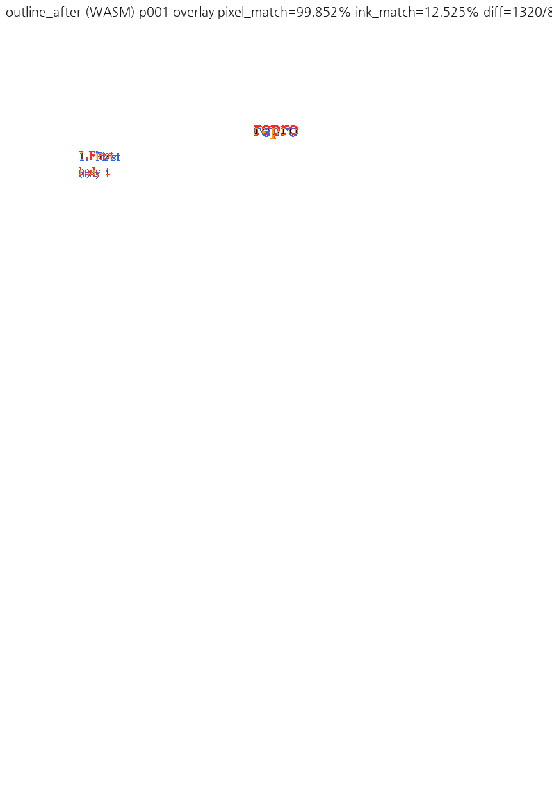
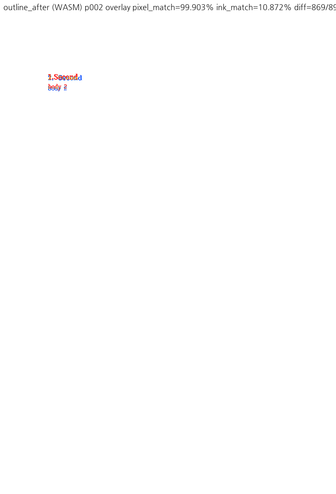

# PR #7230 검토

## 최종 판정

**머지 보류** — #7238과 함께 적용한 통합본에서 CLI와 코어의 문단 시작 쪽 나눔 계약이 갈라진다. 원 PR의 Page/Section no-op 의도를 결함으로 단정하지 않으며, 통합 계약을 합의·정리하기 전에는 승인하지 않는다.

이 판정은 로컬 cherry-pick 통합 검토이며 GitHub APPROVE 제출·remote push·PR 생성·merge·issue close는 수행하지 않았다.

## Metadata·계보·CI

| 항목 | 확인값 |
| --- | --- |
| PR | [#7230: 수정: 문단 시작 쪽 나눔은 문단을 가르지 않는다 (#7218)](https://github.com/edwardkim/rhwp/pull/7230) |
| 작성자 / reviewer | planet6897 / jangster77 |
| base / state | devel / OPEN, non-draft |
| 규모 | 13 files, +295/-8, 1 commit |
| source head | `09fc9296080ed7eefc39791e06d6c2e207954201` |
| 적용 commit / 통합 code head | `368d6e4f8` / `3127bcce945b00bf7c767df2fb9da1f67ebb3633` |
| 조회 상태 | MERGEABLE / CLEAN; merge 직전 재조회 필요 |

- [Build & Test](https://github.com/edwardkim/rhwp/actions/runs/35195797233/job/105122194167): **SUCCESS**.
- [Native Skia tests](https://github.com/edwardkim/rhwp/actions/runs/35195797233/job/105118711901): **SUCCESS**.
- [CodeQL](https://github.com/edwardkim/rhwp/runs/105119438148): **SUCCESS**.

SKIPPED/NEUTRAL은 해당 검사가 실행되어 통과했다는 의미로 세지 않는다. source CI는 통합 head의 CI가 아니다.

## 코드·독립 실행 심사

CLI `src/cli/commands/edit/document_text.rs:438` → `mark_page_break_at_paragraph_start_native`(:3868)로 진입한다. 이 helper는 Page/Section에서 no-op이며 `raw_break_type = 0x04`로 덮어쓴다. 반면 #7238의 `insert_page_break_native`(:3726)는 `|= 0x04`, `page_break_synthesized=false`와 reflow/vpos 갱신을 수행한다. 같은 offset 0 기능을 서로 다른 계약으로 유지하는 통합 문제다. helper의 "insert_page_break_native는 offset과 무관하게 분할" 주석도 통합 후 사실과 다르다.

**실행으로 확인한 경로 차이:** 커밋된 `samples/issue7218/outline_headings.hwpx`에 아래 CLI를 실행하면 성공·`paragraphDelta:0`·`pageBreakParagraph:0` 응답이지만 저장된 첫 `hp:p`는 `pageBreak="0"`이다. 구역 시작을 이미 쪽 나눔으로 취급한 #7230 원 설계의 결과이며, #7238의 "구역 시작에도 pageBreak=1" 주장과 충돌한다. 첫 쪽이 1쪽으로 유지된 사실 자체는 결함으로 세지 않는다.

```bash
rhwp edit insert-page-break samples/issue7218/outline_headings.hwpx \
  --section 0 --para 0 --offset 0 -o /tmp/section-start.hwpx --json
```

정상 대상 `--para 3 --offset 0` 출력은 커밋된 `outline_headings_pagebreak_after_fix.hwpx`와 ZIP 내부 모든 member가 byte 동일했다. 문단 5개를 유지하고 대상에 pageBreak=1이 생긴다. 기존 파일을 그대로 Visual Sweep에 사용해 중복 HWPX를 추가하지 않았다. CLI 3개·중간 분할/봉투 계약 3개와 #7238 core 4개가 통과했지만, 이들 통과는 위 두 제품 경로의 동등성 증거가 아니다.

**코드 검토상 우려:** 별도 helper는 다른 break 비트를 덮고 synthesized 표시도 명시적으로 해제하지 않는다. HWP3/다단 실제 입력에서 새 손실을 재현했다고 주장하지 않는다. 필드 조합의 명시적 보존 테스트와 실제 저장 후 재열기 검사가 필요하다.

기준 PDF는 after p2를 `2. Second`로 표시하지만 rhwp는 `1.Second`다. base와 통합본의 해당 SVG가 byte 동일하므로 이번 변경의 신규 번호 회귀로 분류하지 않는다. before/after 한컴 PDF의 빈 개요 문단 제거는 확인했다.

**해제 조건:** CLI/MCP의 offset 0을 하나의 공통 속성 계약으로 정리하고 Section·Page·다단/단 비트·synthesized 경계의 제품 CLI 저장/재열기까지 검사한다. Studio/HwpCtrl 명령 의미를 같은 것으로 단정하지 말고 #7238의 독립 확인과 함께 결정한다. #7218은 통합 계약을 해소하기 전 닫지 않는다.

## 공통 조판 원칙 준수

렌더 영향: **있음, Visual Sweep 필수**. 편집/생성 경로도 페이지 가시 출력과 fixture/PDF 주장을 포함하므로 적용한다.

| 항목 | 판정 | 근거 |
| --- | --- | --- |
| 구현 근거와 일반성 | 미충족 | 통합 CLI/helper와 코어의 속성 계약 분기 |
| 측정·배치 일관성 | 미검증 | helper와 core reflow/vpos 차이의 경계 입력 미검증 |
| 분할·이어받기 계약 | 미충족 | offset 0 대상은 같지만 Section/다른 break 축 계약 불일치 |
| 줄 소속과 점유 높이 | 비해당 | 표 조각 높이/LineSeg 규칙을 바꾸지 않음 |
| 사례와 증거의 독립성 | 충족 | 커밋 fixture·한컴 PDF·실제 CLI 저장 확인 |
| 기준값 변경 | 충족 | 분할 검사는 문단 중간에 유지, CLI 3개·core 4개 모두 보존 |
| 주장과 검증 범위 | 충족 | 실행된 차이/코드 우려/기존 번호 차이를 구분 |

[통합 검토 공통 실행·binary/WASM hash·명령·정확한 검증 범위](pr_7212_review.md#통합-검토-공통-실행)를 따른다.

## Visual Sweep 직접 검토

DPI 96, Chrome webfont 경로. 모든 아래 선택쪽의 compare·standalone overlay·review를 직접 확인했다. 자동 후보는 reviewer 판정이 아니다. pixel/ink는 선택쪽 평균이며 백지 비율이 큰 문서의 높은 pixel 값은 정합성 근거가 아니다.

| key / 선택쪽 | rhwp/PDF 전체쪽 | 자동 후보 Native/WASM | base ink% | Native pixel% / ink% | WASM ink% |
| --- | --- | --- | --- | --- | --- |
| outline_before / 1,2 | 2/2 | 0/0 | 12.35890 | 99.87663 / 12.35890 | 12.35890 |
| outline_after / 1,2 | 2/2 | 0/0 | 11.69832 | 99.87725 / 11.69832 | 11.69832 |

fidelity의 outline before/after는 page-count 2/2다. 후보가 없더라도 PDF의 개요 번호와 실제 SVG 번호의 차이는 사람이 확인해 별도 기록했다.

### 입력 커밋 확인 — 충족

아래 실제 실행 파일 모두 code head Git blob과 byte hash를 대조했다. 기존 원본/기준을 재사용했으며 별도 이름의 중복 입력은 추가하지 않았다. 신규 PR PDF는 한컴 변환 산출물을 그대로 사용했다. PDF format/Creator 버전 때문에 제외하거나 재변환하지 않았다.

| 경로 / 역할 | SHA-256 | 확인 commit |
| --- | --- | --- |
| [samples/issue7218/outline_headings_pagebreak_before_fix.hwpx](../../../samples/issue7218/outline_headings_pagebreak_before_fix.hwpx) / 입력 | `81b9aee85f6fb29bb1adc6597e7b4a305348adc340a79b6bf50eff544da30b94` | `3127bcce9` |
| [samples/issue7218/outline_headings_pagebreak_before_fix-2020.pdf](../../../samples/issue7218/outline_headings_pagebreak_before_fix-2020.pdf) / 한컴 기준 | `9f0ee8c5f43173e26c75cfa9980cdbcf1a3a5afa6b1bb25925d35b86da878f1f` | `3127bcce9` |
| [samples/issue7218/outline_headings_pagebreak_after_fix.hwpx](../../../samples/issue7218/outline_headings_pagebreak_after_fix.hwpx) / 입력 | `fc5f4dcb2471345a9282711e08c5c4c7312ead8420e8c69ed7748a28ce00fcea` | `3127bcce9` |
| [samples/issue7218/outline_headings_pagebreak_after_fix-2020.pdf](../../../samples/issue7218/outline_headings_pagebreak_after_fix-2020.pdf) / 한컴 기준 | `1c9e5b58b6000d50f48a6e90b406fcf0001f24d292065d34eeb7e1aa7f5da1f1` | `3127bcce9` |
| [samples/issue7218/outline_headings.hwpx](../../../samples/issue7218/outline_headings.hwpx) / CLI 원본 | `0e65077c16ae889497d03b77178bb8f1039358a7a609badbf99966b6b694e98a` | `3127bcce9` |

### 직접 확인한 PNG 증적

대표 그림을 접힌 영역 없이 아래에 표시한다. 나머지 standalone overlay·compare·review 경로와 SHA-256은 이어지는 표에 있다.







| PNG | SHA-256 |
| --- | --- |
| [outline_before_wasm_compare_001.png](../assets/pr7230_review/outline_before_wasm_compare_001.png) | `d6f7466d25252a744f752bc70f1a92df6808915fb71d46527677a3e04ca60285` |
| [outline_before_wasm_overlay_001.png](../assets/pr7230_review/outline_before_wasm_overlay_001.png) | `fe029e8709cbff315d08e50decf4ae5ccfd5f4352bd7676adcb53845e65916ea` |
| [outline_before_wasm_review_001.png](../assets/pr7230_review/outline_before_wasm_review_001.png) | `f10c5ce04dc12b492ac8435bbf2811c7b37ddd35ae076d7e95550dc2f83baebc` |
| [outline_before_native_overlay_001.png](../assets/pr7230_review/outline_before_native_overlay_001.png) | `eaf9ef65a02595f6f58dd390b9fc2bbc4782bc93c97b20b7e723a66e83ccc3fe` |
| [outline_before_base_overlay_001.png](../assets/pr7230_review/outline_before_base_overlay_001.png) | `eaf9ef65a02595f6f58dd390b9fc2bbc4782bc93c97b20b7e723a66e83ccc3fe` |
| [outline_before_wasm_compare_002.png](../assets/pr7230_review/outline_before_wasm_compare_002.png) | `af88b17b8a708bb9be7dca1738008b7d3c6ddd2a62b92f76c27542377e1e0f77` |
| [outline_before_wasm_overlay_002.png](../assets/pr7230_review/outline_before_wasm_overlay_002.png) | `8d18f74a76d5f15cac2ae1d278128eb46a10838a7971504054987d615b662d26` |
| [outline_before_wasm_review_002.png](../assets/pr7230_review/outline_before_wasm_review_002.png) | `3cdad296eec57bcb017c6313f5d13353517e75ddb3c1477755113a941f5b73a9` |
| [outline_before_native_overlay_002.png](../assets/pr7230_review/outline_before_native_overlay_002.png) | `58e7708ec499595f686b9a66845e7471f2f51987f02b397953c7c95d6e5bf889` |
| [outline_before_base_overlay_002.png](../assets/pr7230_review/outline_before_base_overlay_002.png) | `58e7708ec499595f686b9a66845e7471f2f51987f02b397953c7c95d6e5bf889` |
| [outline_after_wasm_compare_001.png](../assets/pr7230_review/outline_after_wasm_compare_001.png) | `1397f37f2b71d3089861a4029ceb9341039a75fb2105eb4ae9607b169894fcce` |
| [outline_after_wasm_overlay_001.png](../assets/pr7230_review/outline_after_wasm_overlay_001.png) | `703b142912cd22c31de83d15070a8b67a5a6e695fd9cb35f4305fa4377c79af1` |
| [outline_after_wasm_review_001.png](../assets/pr7230_review/outline_after_wasm_review_001.png) | `6fd50d97e11641af5799c3990f24c6107496c1a2e6590b75a7abe46380ffdc78` |
| [outline_after_native_overlay_001.png](../assets/pr7230_review/outline_after_native_overlay_001.png) | `34279ef53998bc925399be40f59c38aac84a24927e81f593757247034783d16f` |
| [outline_after_base_overlay_001.png](../assets/pr7230_review/outline_after_base_overlay_001.png) | `34279ef53998bc925399be40f59c38aac84a24927e81f593757247034783d16f` |
| [outline_after_wasm_compare_002.png](../assets/pr7230_review/outline_after_wasm_compare_002.png) | `5488f62568363e7d5f328cef58465befe29c8679499fe58912538589a5069620` |
| [outline_after_wasm_overlay_002.png](../assets/pr7230_review/outline_after_wasm_overlay_002.png) | `f4d6f51918ea26f07c8cfb7d5811ef41ed9ebd313d5a9b99ec4dace943fc580f` |
| [outline_after_wasm_review_002.png](../assets/pr7230_review/outline_after_wasm_review_002.png) | `776b85ae584e041afbdc1bcca059a2368ad672d74d42b780e2b1e61a006801ec` |
| [outline_after_native_overlay_002.png](../assets/pr7230_review/outline_after_native_overlay_002.png) | `3b18f758a52038cdfd14e43acc0cbac96e442d3908b1d9bde2fbcee9dd57eea1` |
| [outline_after_base_overlay_002.png](../assets/pr7230_review/outline_after_base_overlay_002.png) | `3b18f758a52038cdfd14e43acc0cbac96e442d3908b1d9bde2fbcee9dd57eea1` |

## Merge 후 contributor PR comment 계획

보류 PR은 해제·최종 CI·실제 merge가 완료된 뒤에만 게시한다. 한국어로 기여에 감사하고 실제 merge SHA·최종 head CI URL·수정 범위·실제 검증 범위·남은 차이를 설명한다. [Visual Sweep 정본](https://github.com/edwardkim/rhwp/blob/devel/mydocs/manual/verification/visual_sweep_guide.md#github-merge-comment)을 직접 연결한다.

- `https://raw.githubusercontent.com/edwardkim/rhwp/<merge-commit-sha>/mydocs/pr/assets/pr7230_review/outline_after_wasm_review_001.png`
- `https://raw.githubusercontent.com/edwardkim/rhwp/<merge-commit-sha>/mydocs/pr/assets/pr7230_review/outline_after_wasm_overlay_001.png`
- `https://raw.githubusercontent.com/edwardkim/rhwp/<merge-commit-sha>/mydocs/pr/assets/pr7230_review/outline_after_wasm_review_002.png`
- `https://raw.githubusercontent.com/edwardkim/rhwp/<merge-commit-sha>/mydocs/pr/assets/pr7230_review/outline_after_wasm_overlay_002.png`

페이지·후보 수·pixel/ink 지표와 사람의 판정을 함께 적는다. review 패널만으로 standalone overlay를 대체하지 않으며 모든 위 대표 쪽을 댓글 본문에 실제 이미지로 표시하고 `<details>` 밖에 둔다. PR과 관련 issue 댓글 모두 같은 해시 고정 경로를 사용한다. UTF-8 파일+`gh ... --body-file`로 게시한 뒤 API/렌더된 본문에서 한국어·실제 head·이미지 URL과 표시를 재확인한다. 해결하지 않은 issue를 일괄 close하지 않는다.
